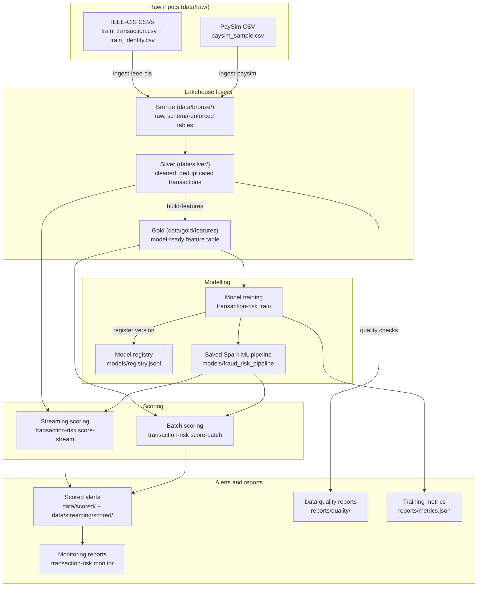
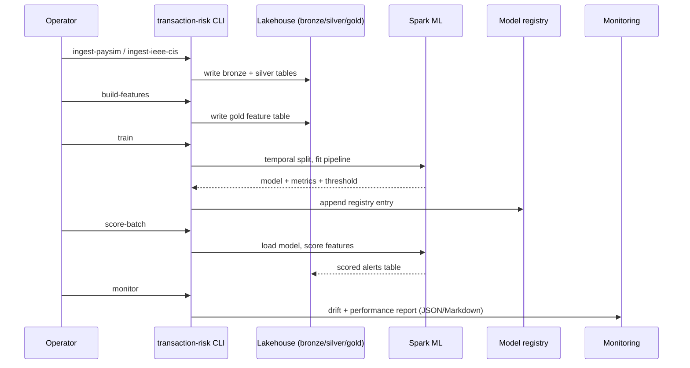

# Architecture

This document describes how data and models flow through the repository, from raw input files to alerts and monitoring reports. Every node in the diagram maps to a real folder or CLI command.

## Lakehouse and model lifecycle

## Layers

- **Raw** (`data/raw/`): input CSV files. PaySim-style data can be generated locally with `make sample-data`; IEEE-CIS files are downloaded with `make download-ieee-cis`. Raw data is never committed.
- **Bronze** (`data/bronze/`): raw data written as schema-enforced Parquet (or Delta) tables, preserving the source shape for reprocessing.
- **Silver** (`data/silver/`): cleaned transactions with deterministic transaction IDs, normalized types, and basic validity filters. Optional expectation checks write data quality reports here.
- **Gold** (`data/gold/features`): the model-ready feature table with transaction, temporal, entity, graph, and optional identity feature groups.
- **Model training**: temporal split, class weighting, Spark ML pipelines, fraud-specific evaluation, threshold selection, and optional probability calibration. Metrics land in `reports/metrics.json`.
- **Model registry** (`models/registry.jsonl`): versioned metadata for each training run — model path, type, metrics, threshold, and training feature table.
- **Batch scoring**: daily-style scoring of materialized feature or transaction tables, producing scores, alert flags, and the selected threshold.
- **Streaming scoring**: a local Structured Streaming demo that scores incoming CSV files micro-batch by micro-batch with the same feature pipeline.
- **Alerts and monitoring**: scored outputs feed monitoring reports covering feature drift, score drift, label-rate drift, and bucketed alert volume, precision, recall, and fraud value capture.

## Train and score lifecycle

